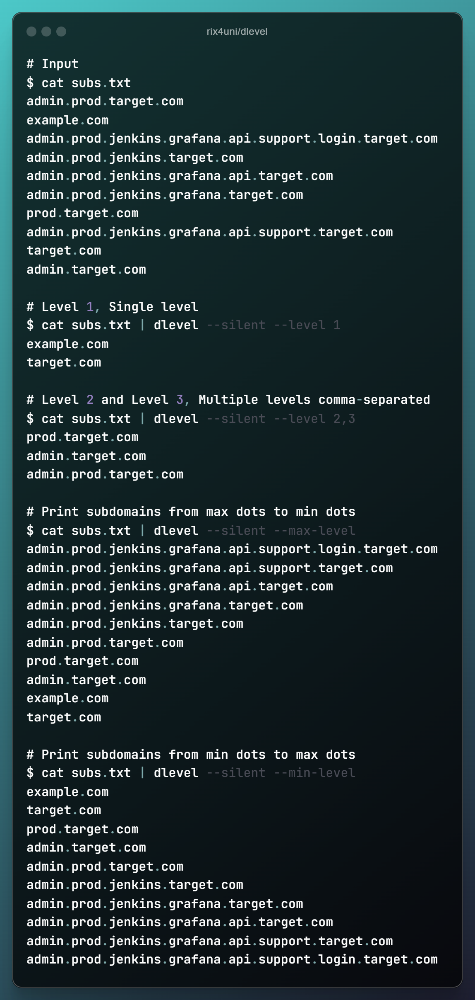

## dlevel

<h2 align="center"><b>Filter list of subdomains by level.</b></h2><br>



## Installation
```
go install github.com/rix4uni/dlevel@latest
```

## Download prebuilt binaries
```
wget https://github.com/rix4uni/dlevel/releases/download/v0.0.2/dlevel-linux-amd64-0.0.2.tgz
tar -xvzf dlevel-linux-amd64-0.0.2.tgz
rm -rf dlevel-linux-amd64-0.0.2.tgz
mv dlevel ~/go/bin/dlevel
```
Or download [binary release](https://github.com/rix4uni/dlevel/releases) for your platform.

## Compile from source
```
git clone --depth 1 github.com/rix4uni/dlevel.git
cd dlevel; go install
```

## Usage
```
Usage of dlevel:
      --level string      Specify the subdomain levels (comma-separated) to filter
      --max-level         Print subdomains from max dots to min dots
      --min-level         Print subdomains from min dots to max dots
      --silent            silent mode.
      --until-count int   Stop after printing this many lines (default -1)
      --until-level int   Stop after reaching this level (dot count) (default -1)
      --version           Print the version of the tool and exit.
```

- `Level 1`: Print domains that have 1 dot (e.g., example.com).
- `Level 2`: Print domains that have 2 dots (e.g., sub.example.com).

## Usage Examples
```bash
# Input
$ cat subs.txt
admin.prod.target.com
example.com
admin.prod.jenkins.grafana.api.support.login.target.com
admin.prod.jenkins.target.com
admin.prod.jenkins.grafana.api.target.com
admin.prod.jenkins.grafana.target.com
prod.target.com
admin.prod.jenkins.grafana.api.support.target.com
target.com
admin.target.com

# Level 1, Single level
$ cat subs.txt | dlevel --silent --level 1
example.com
target.com

# Level 2 and Level 3, Multiple levels comma-separated
$ cat subs.txt | dlevel --silent --level 2,3
prod.target.com
admin.target.com
admin.prod.target.com

# Level 3 and Level 2, Multiple levels comma-separated
$ cat subs.txt | dlevel --silent --level 3,2
admin.prod.target.com
prod.target.com
admin.target.com

# Print subdomains from max dots to min dots
$ cat subs.txt | dlevel --silent --max-level
admin.prod.jenkins.grafana.api.support.login.target.com
admin.prod.jenkins.grafana.api.support.target.com
admin.prod.jenkins.grafana.api.target.com
admin.prod.jenkins.grafana.target.com
admin.prod.jenkins.target.com
admin.prod.target.com
prod.target.com
admin.target.com
example.com
target.com

# Print subdomains from max dots to min dots, and stop after printing 5 lines
$ cat subs.txt | dlevel --silent --max-level --until-count 5
admin.prod.jenkins.grafana.api.support.login.target.com
admin.prod.jenkins.grafana.api.support.target.com
admin.prod.jenkins.grafana.api.target.com
admin.prod.jenkins.grafana.target.com
admin.prod.jenkins.target.com

# Print subdomains from max dots to min dots, and stop after reaching 6 level
$ cat subs.txt | dlevel --silent --max-level --until-level 6
admin.prod.jenkins.grafana.api.support.login.target.com
admin.prod.jenkins.grafana.api.support.target.com
admin.prod.jenkins.grafana.api.target.com

# Print subdomains from min dots to max dots
$ cat subs.txt | dlevel --silent --min-level
example.com
target.com
prod.target.com
admin.target.com
admin.prod.target.com
admin.prod.jenkins.target.com
admin.prod.jenkins.grafana.target.com
admin.prod.jenkins.grafana.api.target.com
admin.prod.jenkins.grafana.api.support.target.com
admin.prod.jenkins.grafana.api.support.login.target.com

# Print subdomains from min dots to max dots, and stop after printing 5 lines
$ cat subs.txt | dlevel --silent --min-level --until-count 5
example.com
target.com
prod.target.com
admin.target.com
admin.prod.target.com

# Print subdomains from min dots to max dots, and stop after reaching 6 level
$ cat subs.txt | dlevel --silent --min-level --until-level 6
example.com
target.com
prod.target.com
admin.target.com
admin.prod.target.com
admin.prod.jenkins.target.com
admin.prod.jenkins.grafana.target.com
admin.prod.jenkins.grafana.api.target.com
```